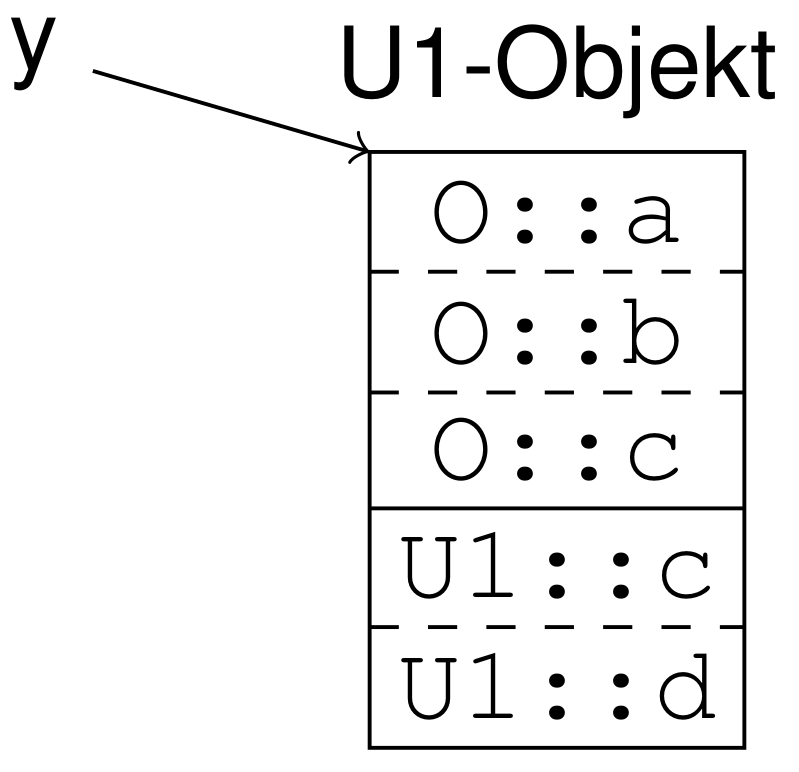
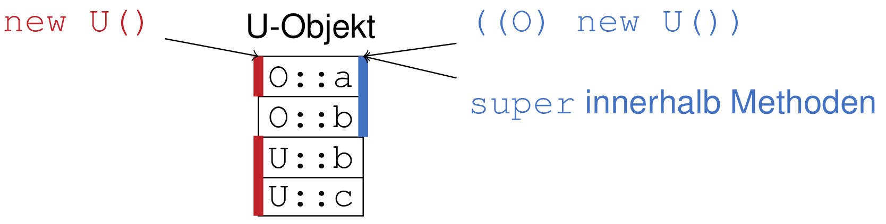
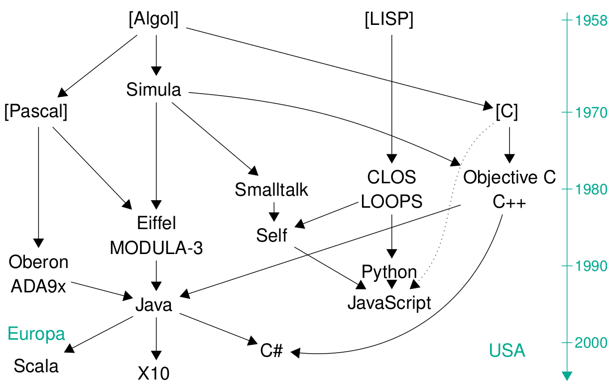

# Allgemeine Konzepte

## TOC

<!-- @import "[TOC]" {cmd="toc" depthFrom=2 depthTo=3 orderedList=false}  -->
<!-- code_chunk_output -->

* [TOC](#toc)
* [Vokabeln](#vokabeln)
* [Dynamische Bindung](#dynamische-bindung)
	* [Upcasts und dynamische Bindung](#upcasts-und-dynamische-bindung)
	* [this-Zeiger](#this-zeiger)
* [Subobjekte](#subobjekte)
* [v-table](#v-table)
* [Abschalten dynamischer Bindung](#abschalten-dynamischer-bindung)
* [Type Casts](#type-casts)
* [Objektbegriff](#objektbegriff)
* [Tücken der dynamischen Bindung](#tücken-der-dynamischen-bindung)

<!-- /code_chunk_output -->

## Vokabeln

* Objekt
	* context abhängig, meistens = "Bezugsobjekt"
* Bezugsobjekt
	* =  alle subobjekte
	* ist struct im Speicher
	* 1 pro Instanziierung
	* Größe und relative Positionen innerhalb stehen zur compile time fest
	* Absolute Position im Speicher steht zur run time fest
* statischer Typ
	* Typ zur compile time
* dynamischer Typ
	* Typ zur run time
* up cast/down cast
	* ändern des statischen Types (bei C++ und Java)
* virtual
	* immer, wenn dem Stoustrup kein Wort eingefallen ist
* smart
	* immer wenn etwas einfaches kompliziert gemacht wird
* verdeckt
	* bei dynamisch: = überschrieben
	* bei statisch: = versteckt
* Objektlayout
	* Diagram den Objektes im Speicher. Mit Subobjekte. Optional mit Attributen
	* {width=150}

## Dynamische Bindung

Member:

* immer statisch

Funktionen:

* öffentlich: immer dynamisch
* privat: immer statisch

Zugriff auf verdeckte Member:

* bei statischer Bindung:
	* upcast dann Zugriff
* bei dynamischer Bindung:
	* C++:
		*  `::`
		* "_scope operator_"
		* in Methoden: `K::c()`
		* außerhalb: `o.K::c()`
	* Java:
		* `super`
		* direkte Oberklasse
		* in Methoden: `super.c()`
		* außerhalb: verboten
	* `super` und `::` schalten dynamische Bindung ab

### Upcasts und dynamische Bindung

**Upcasts schalten _nicht_ die dynamische Bindung ab!**

und downcasts auch nicht (vermutlich)

### this-Zeiger

ganz normaler pointer mit statischer Typ = aktuelle Klasse.

$\Rightarrow$ es gilt dynamische Bindung

## Subobjekte

subobjekte sind der Grund, weshalb statische Bindung geht.

* pro Objekt ein supobjekt pro (geerbter) Klasse
* Subobjekt besteht aus:
	* vpointer (bei Einfachvererbung reicht 1 pro Gesamtobjekt)
	* eigene Member
* Objektlayout:
	* oben: geerbte Subobjekte
	* unten: Subobjekt der eigenen Klasse
* Zugriff über statische offsets zur compile time

## v-table

v-table sind Grund weshalb dynamische Bindung geht.

* global eine v-table pro Klasse
* jedes Bezugsobjekt (bzws. jeden Subobjekt bei Mehrfachvererbung) hat einen v-pointer, der auf die v-table seiner Klasse zeigt
* enthält Einsprungadressen der Methoden:
	* 1 Eintrag pro Methode
	* redefinierte Methoden überschreiben geerbte Methoden
* Position in vtable wird zur compile time bestimmt
* Position des v-pointer: immer gleich im Subobjekt (i.d.R ganz am Anfang)
* Zugriff zur run time:

		load [x + OFFSET VPTR], reg0
		load [reg0 + OFFSET g], reg1
		call reg1

## Abschalten dynamischer Bindung

bei folgendem wird immer statisch gebunden:

* private methoden
* attribute
* `super` (java only)

was ist mit `::`? (z.B. `o.K::f()`) (Vorsicht: `((K)o).f()` ist was anderes)

In den Fällen wird bereits zur compile Zeit die Adresse der Funktion eingetragen ohne den Umweg über die v-table zu gehen.

## Type Casts

	class O { int a, b; }
	class U extends O { int b, c; }

	O x = new U()

Durch casts wird *nur* ein anderes Subobjekt ausgewählt

{width=500}

--> member werden sichtbar, Methoden aber nicht.

down cast: unsicher, schlechter stil

## Objektbegriff

Ziel von Objektorientierung:

* Geheimnisprinzip
* Lokalitätsprinzip

Klassifikation von OO-Sprachen

* Typisierung
	* statisch: c++, java
	* dynamisch: self, smalltalk
* Methodenaufrufe
	* echte Klassen: c++, java
	* objektbasiert ohne Klassen: javascript
* Abstraktion
	* statisch Schnittstellen
	* Zugriffsrechte für Klassen

{width=500}

## Tücken der dynamischen Bindung

**Dynamische Bindung greift auch bei Rekursion!**

d.h. wenn man versucht mit `super.m()` eine Rekursive Methode `m` im parent aufzurufen, dann kann es sein, dass die zweite Iteration wieder in der cildklasse ist, auch wenn die erste Iteration im parent war. (Vorraussetzung: `m` wird in childklasse überschrieben)

**Dynamische Bindung im Konstruktor**

Im Funktionen, die im parent Konstrutor aufgerufen werden, können in Childklase überschrieben werden.

+ Kontruktoren von der Childklasse mussen immer den Kontruktor vom parent aufrufen.
