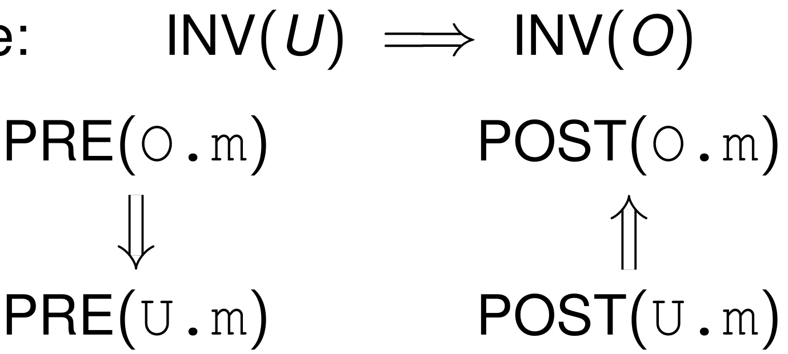
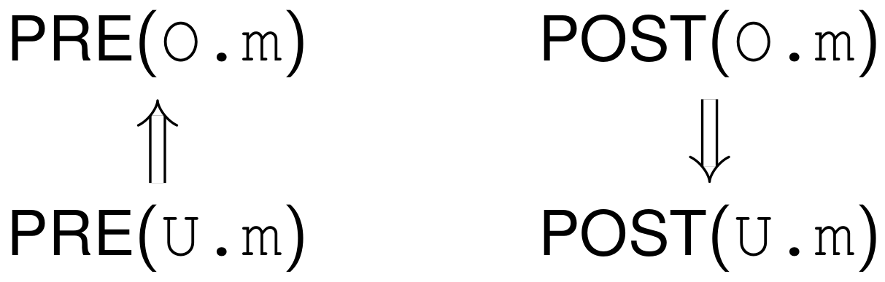
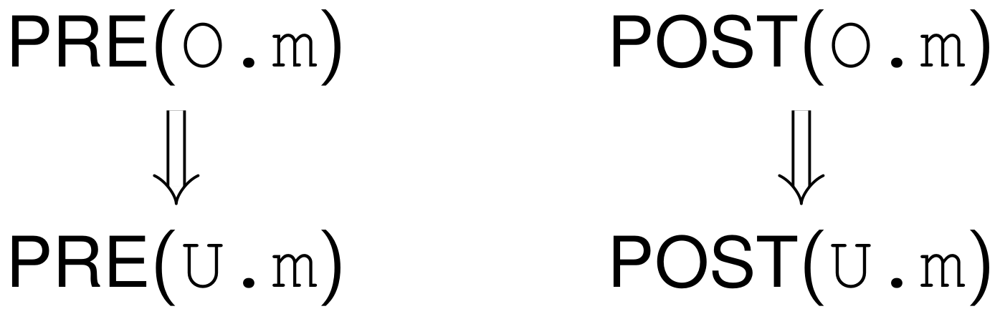
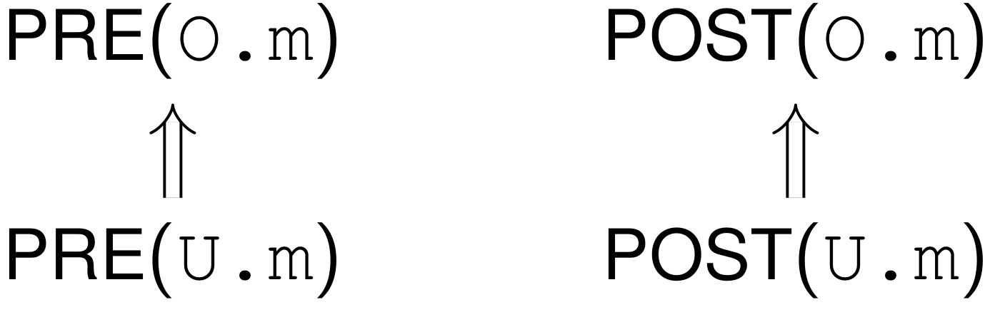

# Invarianten und sichere Vererbung

## TOC

<!-- @import "[TOC]" {cmd="toc" depthFrom=2 depthTo=3 orderedList=false} -->
<!-- code_chunk_output -->

* [TOC](#toc)
* [Motivation](#motivation)
* [Verhaltenskonformanz](#verhaltenskonformanz)
	* [Vokabeln](#vokabeln)
	* [Realisierung Verhaltenskonformanz](#realisierung-verhaltenskonformanz)
* [Weitere Verhaltensbeziehungen](#weitere-verhaltensbeziehungen)
	* [Spezialisierung](#spezialisierung)
	* [Verhaltenskovarianz](#verhaltenskovarianz)
	* [Verhaltenskontravarianz](#verhaltenskontravarianz)
* [Inheritance is not Subtyping](#inheritance-is-not-subtyping)

<!-- /code_chunk_output -->

## Motivation

`class U extends O`

**Typkonformanz**: Jedes U ist auch als O verwendbar, denn es hat mindestens die selben Members im O-Subobjekt

Problem: U kann O -Methode so umdefinieren, dass sie etwas völlig anderes macht

⇒ Stärkere Forderung:

**Subtyping**: Klientencode funktioniert auch mit U statt O

Andere Namen:

* **Verhaltenskonformanz**
* Klientencode-Wiederverwendung
* Liskov’sches Substitutionsprinzip [LW94]
* Inclusion Polymorphism

## Verhaltenskonformanz

Für Klienten sichere Vererbung erfordert Verhaltenskonformanz

Aus Sicht des Methoden**verhaltens** ist jedes U -Objekt auch ein O -Objekt.

→ Man kann O durch U ersetzen und garantieren, dass nicht kaputt geht

Anwendung: Implementierung von Oberlasse oder Interface

### Vokabeln

**Klasseninvariante**:
Wird pro Klasse definiert.
Gilt vor und nach jedem Methodenaufruf.

**Precondition**: Wird pro Methode definiert.
Muss gelten, damit die Methode aufgerufen werden darf.

_→ Das, was die Methode braucht_

**Postcondition**: Wird pro Methode definiert. Gilt nachdem die Methode durchgelaufen ist.

_→ Das, was die Methode tut_

### Realisierung Verhaltenskonformanz

Klasseninvariante von Unterklasse $U$ ist stärker als von Oberklasse $O$:

$$INV ( U ) ⇒ INV ( O )$$

**stärkere Vorbedingung in Oberklasse: **

_→ Oberklasse verlangt mehr_

$$PRE (O.m) ⇒ PRE (U.m)$$

**stärkere Nachbedingung in Unterklasse:**

_→ Unterklasse leistet mehr_

$$POST (U.m) ⇒ POST (O.m)$$

**_→ Unterklasse verlangt weniger und leistet mehr_**

{width=200}

## Weitere Verhaltensbeziehungen

### Spezialisierung

= _Gegenteil von Verhaltenskonformanz_

Problem: Verhaltenskonformanz in der Praxis selten, weil schwierig umzusetzen

Häufiger: Spezialisierung. (leistet auch etwas, jedoch was ganz anderes)

{width=200}

Anwendung: Implementierung für Spezialfälle

### Verhaltenskovarianz

Implikation in Vererbungsrichtung

{width=200}

### Verhaltenskontravarianz

Implikation entgegen Vererbungsrichtung

{width=200}

## Inheritance is not Subtyping

Inheritance → Spezialisierung

Subtyping → Verhaltenskonformanz

→ Trennung von Klassen und Typen

Java: Interfaces für Subtyping, Klassenvererbung für Inheritance
