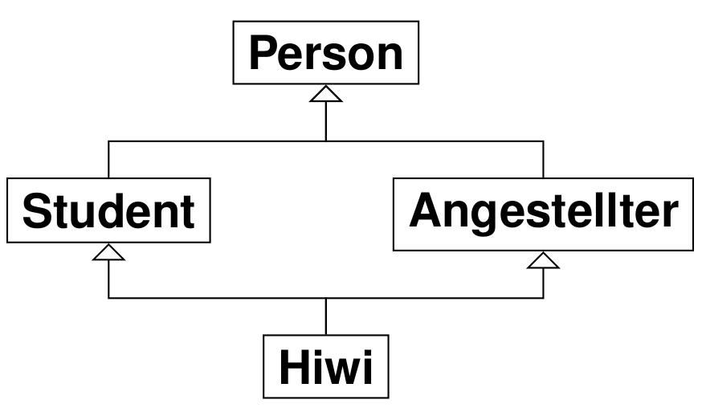
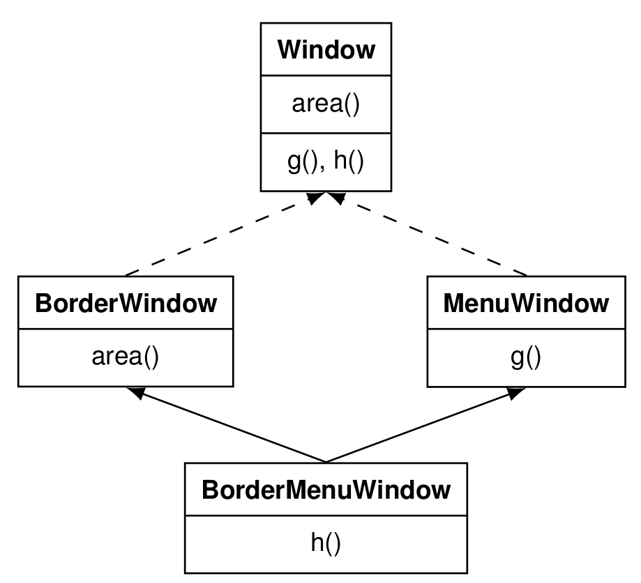
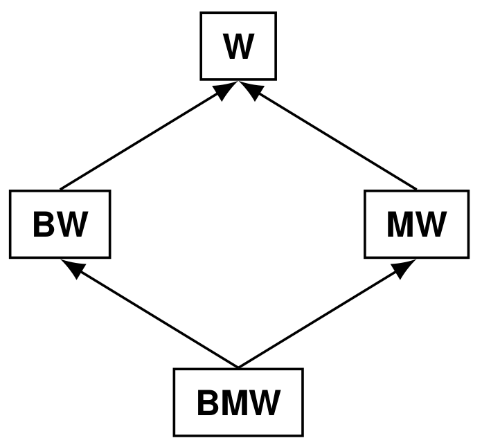
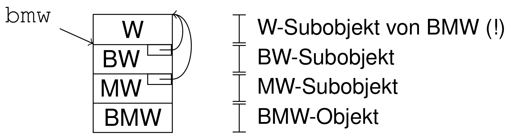
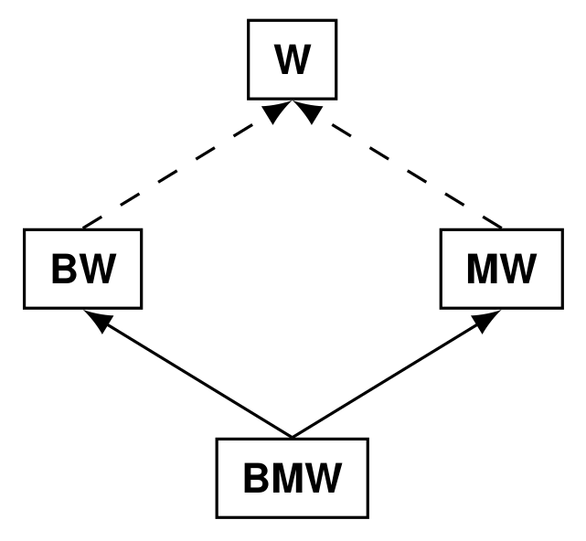
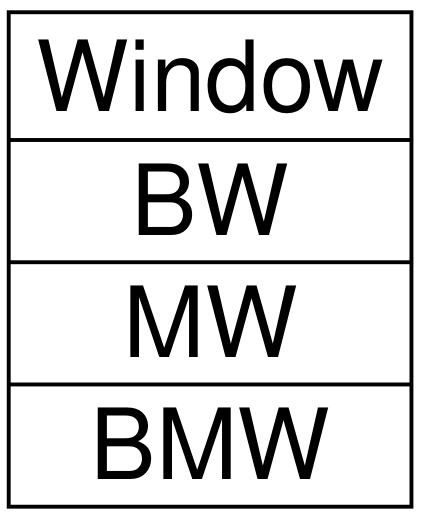
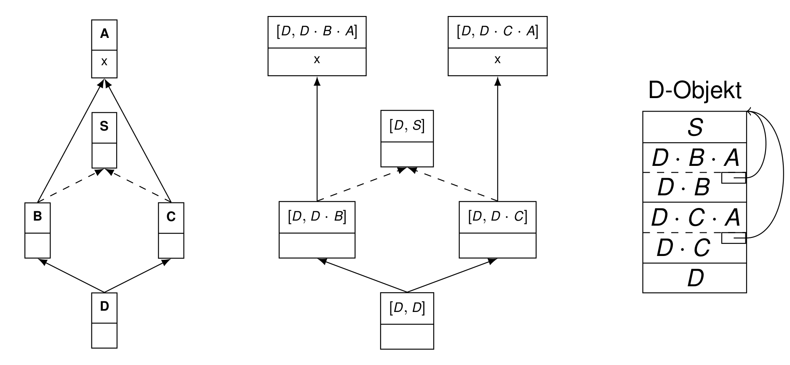

# Mehrfachvererbung

{width=250}

## TOC

<!-- @import "[TOC]" {cmd="toc" depthFrom=2 depthTo=3 orderedList=false} -->
<!-- code_chunk_output -->

* [TOC](#toc)
* [Mehrfachvererbung in C++](#mehrfachvererbung-in-c)
	* [Nicht-virtuelle Vererbung in C++](#nicht-virtuelle-vererbung-in-c)
	* [virtuelle Vererbung in C++](#virtuelle-vererbung-in-c)
* [Subobjektgraphen](#subobjektgraphen)
	* [Konstruktion von Subobjektgraphen](#konstruktion-von-subobjektgraphen)
* [Static Lookup](#static-lookup)
	* [Formale Definition](#formale-definition)
* [Dynamic lookup](#dynamic-lookup)
* [Static lookup vs Dynamic lookup](#static-lookup-vs-dynamic-lookup)

<!-- /code_chunk_output -->
 

## Mehrfachvererbung in C++

C++ erlaubt Klassen-Mehrfachvererbung

Beispielanwendung: GUI-Fenster mit Rand und Menüleiste

{width=300}

	class Window {
		virtual int area() { ... }
		virtual void g() { ... }
		virtual void h() { ... }
	};
	class BW : public virtual Window {
		virtual int area() { ... }
	};
	class MW : public virtual Window {
		virtual void g() { ... }
	};
	class BMW : public BW, public MW {
		virtual void h() { ... }
	};

	BMW* bmw = new BMW(); // bmw ist Zeiger auf BMW −Objekt
	MW* mw = bmw; // Impliziter Upcast
	mw->area(); // Ruft BW: : area( ) auf !

### Nicht-virtuelle Vererbung in C++

* Standardvererbungstyp
* Durchgezogene Linie im Klassendiagramm
* nur von historischer Bedeutung

		class BW : public W { ... };

{width=200}

{width=300}

### virtuelle Vererbung in C++

* Schlüsselwort `virtual`
* Gestrichelte Linie im Klassendiagramm
* Unterklassenobjekt enthält Zeiger auf Oberklassenobjekt
* in der Praxis verwendet

	class BW : public virtual W { ... };

{width=300}

{width=150}

{width=60}

## Subobjektgraphen

{width=600}

Warum: Bei nicht-virtueller Vererbung entstehen komplexe Subobjekte, die z.T Duplikate enthalten

* Knoten [C, C·B·A]:
	* Subobjekte
	* "_Das C B A Subobjekt eines C-Objektes_"
* Kanten $S \rightarrow S'$ (durchgezogen)
	* _default Vererbung_
	* $S'$ ist direkt in $S$ enthalten
* Kanten $S \dashrightarrow S'$ (gestrichelt)
	* _virtuelle Vererbung_
	* $S$ hat pointer auf $S'$

### Konstruktion von Subobjektgraphen

**Gegeben**: Klassenhierarchie mit virtueller und nicht-virtueller
Vererbung

**Gesucht**: Zugehöriger Subobjektgraph

Definitionen:

Symbol  | Bedeutung
--- | ---
$X <_N Y$ | $X$ erbt **direkt** und **nicht-virtuell** von $Y$
$X <_V Y$ | $X$ erbt **direkt** und **virtuell** von $Y$
$X < Y$ | $X$ erbt **direkt** von $Y$
$X <^* Y$ | $X$ erbt **indirekt** von $Y$, reflexive transitive Hülle von $<$
$X \sqsubset_p Y$ | Pfad der Länge $p$ von $X$ nach $Y$,  $\sqsubset_1$ ist Kante

#### Ermitteln der Knoten

* $[X,X]$ ist _Gesamtobjekt_
* $[X α·X·Z]$ ist Subobjekt
	* Wenn $[X, α·Y]$ Subobjekt
	* und $Y<_N Z$
* $[X,Z]$
	* wenn  $[X, α]$ Subobjekt
	* und $∃_Y:$
		* $X <^* Y$
		* und $Y <_V Z$

#### Ermitteln der Kanten

$\sqsubset_1$: Kante im Graph (sowohl getrichelt als auch durchgezogen)

* $[ X , α] \sqsubset_1 [ X , α · Y ]$
	* _durchgezogen_
* $[ X , α · Y ] \sqsubset_1 [ X , Z ]$
	*  wenn $Y <_V Z$
	* _gestrichelt_

## Static Lookup

**Gegeben**: Klasse `C` in Klassenhierarchie, Membername `m`

**Gesucht**: „Speziellstes“ Subobjekt eines `C`-Objekts, in dem `m` deklariert ist

Problem: Klasse `C` alleine reicht nicht. Man muss bei Subobjekt anfangen zu suchen.

`lookup(σ,m) = ο'`:

* `σ`: Ausgangssubobjekt
* `m`: gesuchte Methode
* `ο'`: gesuchtes Subobjekt
* Beispiel: `lookup([C,C],x) = [C,C·B]`

Falls mehreindeutig: Wähle Dominantes Subobjekt.
Falls immernoch  mehreindeutig: `return ⊥`

Dominanzrelation: Das dominante Subobjekt ist spezieller. D.h. es steht gibt im Subobjektgraphen einen Pfad vom dominanten Supobjekt zum dominiertem Subobjekt.

### Formale Definition

$$lookup (σ, m ) = min ( Defs (σ, m ))$$

Bemerkung:

* $min(…)$ ist das kleinste Subobjekt bzgl. $\sqsubset$
* Historisch wurde min $(…)$ auch „größtes“ Subobjekt genannt, und
$max$ statt $min$ geschrieben, weil es physikatlisch am größten ist

Definitionen:

* $σ = min ( S )$:
	* $σ$ ist dominantes Subobjekt aus Subobjekt-Menge $S$
	* d.h. $\exists$ Pfad von $σ$ zu jedem anderen Subobjekt in $S$
	* Bsp. $min(\{[ D , D · C · A ], [ D , D ]\}) = [ D , D ]$
* $Member ( C )$:
	*  die Menge aller in Klasse C deklarierten Member
* $ldc ([ C , α · A ]) = A$
	* $A$ ist „least derived class“
	* $=$ letzter Teil in Subobjektschreibweise: [C,C·B·**A**]
* $Defs (σ, m )$
	* $= \{ σ' \sqsupseteq σ | m ∈ Member ( ldc (σ'))\}$
	* Menge aller erreichbaren Subobjekte, die Member $m$ enthalten

## Dynamic lookup

$$dynBind (σ, f ) = min ( Defs ([ mdc (σ), mdc (σ)], f ))$$

mit:

* $mdc ([ C , α · A ]) = C$
	* „most derived class“
	* $=$ erster Teil in Subobjektschreibweise: [C,**C**·B·A]

## Static lookup vs Dynamic lookup
Lemma

$$dynBind (σ, f ) = lookup ([ mdc (σ), mdc (σ)], f )$$

_Dynamische Bindung ist wie statischer Lookup angewendet auf den dynamischen Typ_
