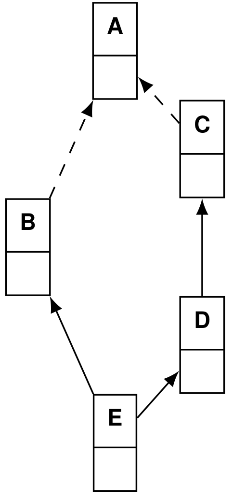

# Implementierung von Mehrfachvererbung

Reminder aus Abschnitt 1:

{width=100}

{width=500}

## C++ Type Casts

* nicht-virtuelle Einfachvererbung ⇒ Nullcode
* nicht-virtuelle Mehrfachvererbung ⇒ Verschiebung des Zeigers
* virtuelle Mehrfachvererbung ⇒ Verfolgen des Subobjektzeigers

### nicht-virtuelle Mehrfachvererbung

{width=200}

	class C : A, B { int c; };
	B* pb; C* pc;

	pb = pc;

wird zu:

	pb = (B*) (((char *) pc) + delta(C, B));

`delta(C, B)`

* Offset des `B`-Subobjekts in einem `C`-Subobjekt
* zur compile time bekannt
* `delta(C, B) = sizeof(A)`

### virtuelle Mehrfachvererbung

{width=150}

	class C : A, virtual B { int c; };
	B* pb; C* pc;

	pb = pc;

wird zu:

	pb = *((B**) (((char *) pc) + offset(B_ptr)));

* `offset(B_ptr)`
	*  Offset des `B`-Subobjekt**zeigers** in `C`-Objekt
	* Frage: zur Übersetzungszeit bekannt?

### Ausnahmen

* Nullzeiger werden nicht verschoben
	* Zur Laufzeit: if null return null

## Implementierung vtables

* Enthält Einsprungadressen für Methoden
* pro Klasse eine statische vtable "_vtbl_" bei Einfachvererbung
* jedes Objekt enthält Zeiger auf vtbl seiner Klasse
* Indizes für Methodennamen klassenhierarchieweit eindeutig
	* wird vom compiler vorgegeben
* beim Methodenaufruf zusätzlicher Indirektionsschritt:
	* `C* pc = new C(); pc->h(42);` wird zu `(*(pc->vptr[2]))(pc, 42)`

{width=300}

### Mehrfachvererbung mit vtables

* eine `vtable` pro Subobjekt-Typ
* jedes Subobjekt enthält Zeiger auf vtbl seines Subobjekt-Typs
* jede Zeile enthält zusätzlich `delta`

Problem: Methoden müssen ihren statischen Typ kennen, um `this` korrekt casten zu können.

Lösung: pro Methode wird `delta` ebenfalls in `vtable` abgelegt. Damit kann dann beim Methodenaufruf gecastet werden.

{width=500}

**Alternative zu Deltas: Thunks**

Statt Deltas in vtable generiert Compiler bei Bedarf weitere Methode
(Thunk), die this -Pointer entsprechend verschiebt.

Ein Thunk ist sozusagen ein Wrapper

## **(Z)** - Mehrfachvererbung in Java

via interfaces

ab javu 8: Default-Methoden. Damit können auch Methoden mehrfachvererbt werden
