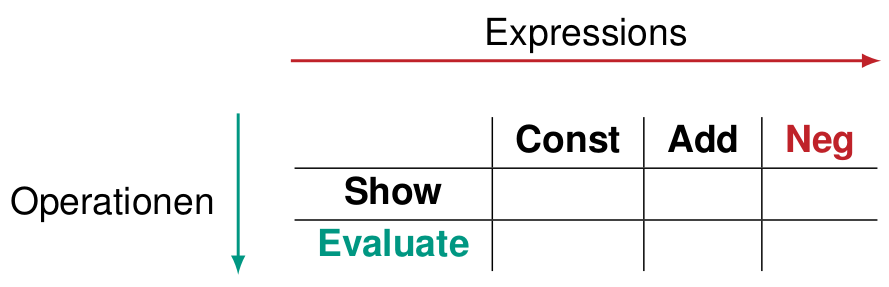

# Tyrannei der dominanten Dekomposition

## TOC

<!-- @import "[TOC]" {cmd="toc" depthFrom=2 depthTo=3 orderedList=true} -->
<!-- code_chunk_output -->

1. [TOC](#toc)
2. [Warum Dekomposition](#warum-dekomposition)
3. [bisherige Arten von Dekomposition](#bisherige-arten-von-dekomposition)
4. [Lösungsansätze](#lösungsansätze)

<!-- /code_chunk_output -->

## Warum Dekomposition

Ziel: Typsicherheit und Lokalitätsprinzip sind schwer zu veneinbaren.

Problem: Bei Erweiterungen in verschiedenen Hierarchien: Eine Hierarchie dominiert die andere

{width=300}

## bisherige Arten von Dekomposition

Objektorientierte Dekomposition:

	* Operationen als dynamisch gebundene Methoden
	* Neuer Datentyp kein Problem
	* Neue Operation erfordert Änderung aller Expression-Klassen
	* ⇒ **Datentypen dominieren Operationen**

Funktionale Dekomposition:

	* Operationen als Visitor-Objekte
	* Neue Operation kein Problem
	* Neuer Datentyp erfordert Änderung aller Visitor-Klassen
	* ⇒ **Operationen dominieren Datentypen**

## Lösungsansätze

* Multimethoden
	* z.B. in MultiJava
* Traits, Mixins und abstrakte Typmember
	* z.B. in Scala
* Virtuelle Klassen
	* z.B. in Beta
