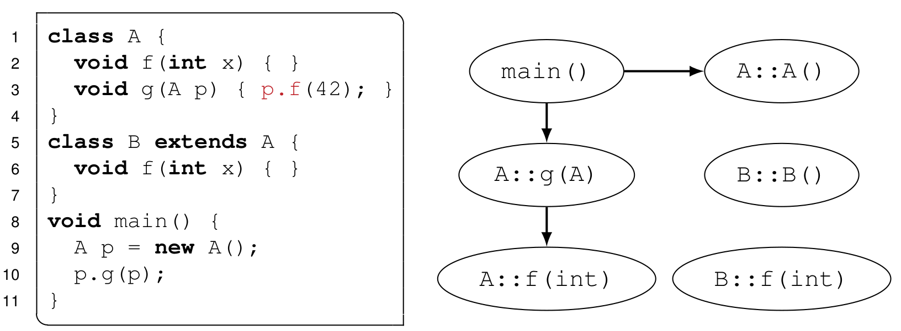
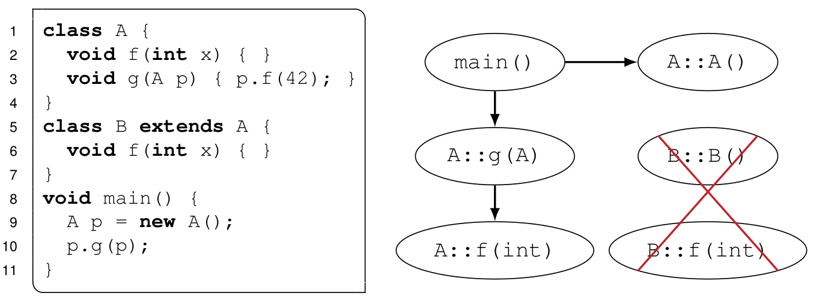
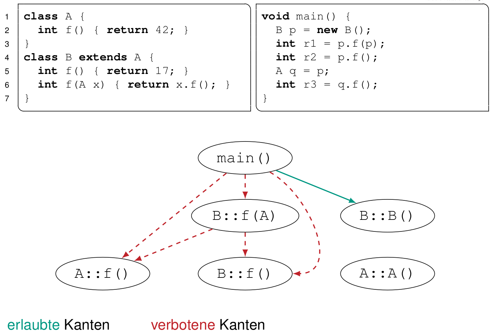
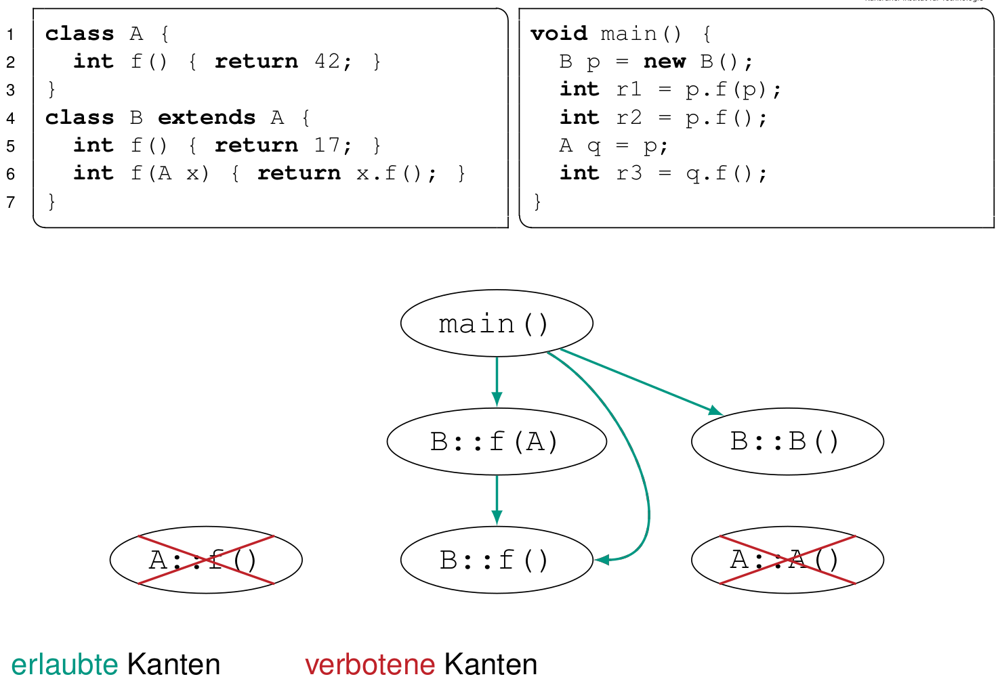
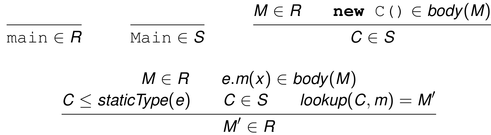
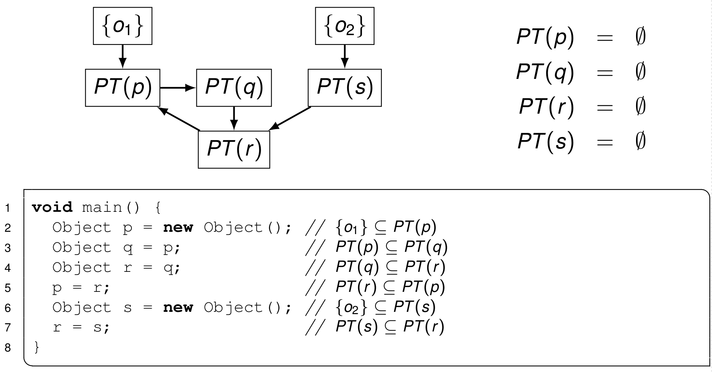
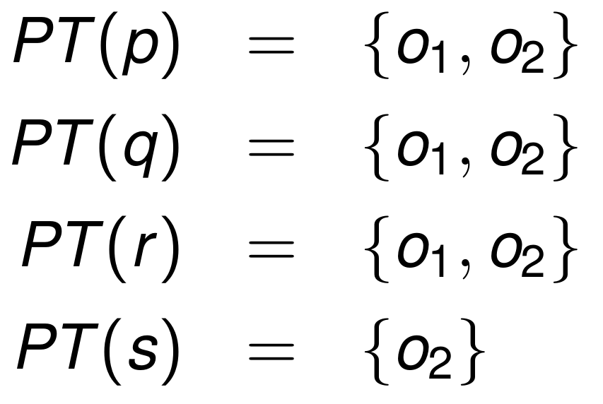
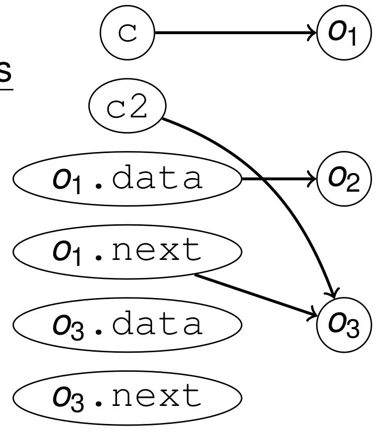

# Programmanalyse

Ziel:

* Optimierung:
	* wenig Speicher
	* entfernen von dynamischer Bindung
* Verständnis & debugging

**Beispiel**:

	class A { void f() { ... } }
	class B extends A { void f() { ... } }
	A p = new B();
	p.f();

⇒ `A.f()` wird neimals aufgerufen und kann entfernt werden

⇒ und `B::f()` kann statisich gebunden werden

## TOC

<!-- @import "[TOC]" {cmd="toc" depthFrom=2 depthTo=3 orderedList=false} -->
<!-- code_chunk_output -->

* [TOC](#toc)
* [Eigenschaften](#eigenschaften)
	* [Fluss-Sensitivität](#fluss-sensitivität)
	* [Kontext-Sensitivität](#kontext-sensitivität)
* [Rapid Type Analysis](#rapid-type-analysis)
	* [Call Graph](#call-graph)
	* [Umgang mit dynamischer Bindung](#umgang-mit-dynamischer-bindung)
	* [Reduktion des Call-Graphs](#reduktion-des-call-graphs)
	* [RTA als Constraint-Problem](#rta-als-constraint-problem)
	* [Fazit](#fazit)
* [Points-To-Analyse](#points-to-analyse)
	* [Points-To-Graph](#points-to-graph)
	* [nach Anderson](#nach-anderson)
	* [nach Stengaard](#nach-stengaard)

<!-- /code_chunk_output -->

## Eigenschaften

* Statische Analyse: ohne Kompilat auszuführen
* Whole-Program-Analyse: Gesamtes Programm (inklusive Klassenhierarchie) bekannt

### Fluss-Sensitivität

Flusssensitive Programmanalysen

* Beachten Reihenfolge der Anweisungen
* Analyseergebnis pro Programmpunkt
* präziser und aufwendiger als Fluss-insensitive Analysen

Fluss**in**sensitive Programmanalysen

* Berechnen Analyseergebnis pro Programm
* ⇒ gleiches Ergebnis für alle Programmpunkte
* Sind unpräziser, aber schneller
* Ergebnis für p im Beispiel: p kann auf o 1 oder o 2 zeigen

Beispiel:

	Object p = new Object(); // o 1
	Object q = new Object(); // o 2
	p = q;

### Kontext-Sensitivität

Kontextsensitive Programmanalysen

* Beachten den Aufrufkontext einer Methode
* Berechnen Analyseergebnis pro Aufrufkontext und pro Methode
* Ergebnis im Beispiel:
	* Bei Aufruf aus f() kann x nur auf o 1 zeigen
	* Bei Aufruf aus g() kann x nur auf o 2 zeigen
* Sind präziser und aufwendiger

Kontext**in**sensitive Programmanalysen

* Ignorieren den Aufrufkontext einer Methode
* Berechnen Analyseergebnis pro Methode
* Ergebnis im Beispiel:
	* x kann auf o 1 oder o 2 zeigen
* Sind unpräziser, aber schneller

Beispiel:

	Object foo(Object x) { return x; }
	void f() { Object p = new Object(); /∗ o 1 ∗/ foo(p); }
	void g() { Object q = new Object(); /∗ o 2 ∗/ foo(q); }

## Rapid Type Analysis

Einfach und schnell, aber wirkungsvoll

**Ziele**: Entfernen toter Members, Eingrenzen dynamischer Bindung

**Idee**: Wenn nie ein C-Objekt erzeugt wird, dann kann
auch nie eine C-Methode aufgerufen werden! (außer von Unterklassen von C)

### Call Graph

**Knoten**: Alle Methoden `C::m(P1, ..., Pn)`, inklusive main()-Methode, Konstruktoren und Überladungen

**Kanten**: Kante von `C::f()` nach `D::g()` ⇔ `C::f()`  hat einen Aufruf `d.g()` mit d vom statischen Typ `D`

{width=500}

**Achtung bei dynamischer Bindung**: Alle potentiellen Ziele des Aufrufs `d.g()` müssen berücksichtigt werden, also auch alle `E::g()` für alle Unterklassen `E` von `D`

### Umgang mit dynamischer Bindung

Konservative Approximation:

Es wird nie ein möglicher Aufruf vergessen, aber manche Aufrufe werden fälschlich als möglich angenommen.

⇒ Menge der Aufrufziele ist manchmal zu groß, aber nie zu klein!

### Reduktion des Call-Graphs

Problem: Durch dyn. Bindung viele unnötige Kanten im Call-Graph

Lösung: finde Konstruktoren, die **nie** aufgerufen werden und entferne alle Methoden dieser Klasse

{width=500}

**Algorithmus**:

1. starte mit Call-Graph (, der dynamische Bindung berücksichtigt)
2. markiere alle Kanten zu virtuellen Methoden als _verboten_
3. markiere alle Kanten **von** `main()` **zu** Konstruktoren als _erlaubt_
4. while (keine neuen Kanten):
	5. Starte bei `main()` und markiere Knoten, die über _erlaubte_ Kanten erreichbar sind
	6. Wenn markierter Knoten Konstruktor von Klasse C ist, markiere alle Kanten als erlaubt, die die **von** markierten Knoten **zu** Methoden der VTable von C zeigen als _erlaubt_
7. Entferne alles, was von `main()` aus nicht über erlaubte Kanten erreichbar isr

**Achtung:** VTable von C kann auch ererbte Methoden enthalten ⇒ Methoden der Oberklasse können erlaubt werden, obwohl nie ein Oberklassenobjekt erstellt wird

Beispiel:

{width=500}

{width=500}

### RTA als Constraint-Problem

RTA auch als Constraint-Problem formulierbar:

* Menge R: Menge der „lebendigen“ Methoden
* Menge S: Menge der „lebendigen“ Klassen

{width=500}

### Fazit

* sehr schnell
	* da fluss- und kontext-insensitiv
	* Overhead bei Kompilierdauer < 5%
* Sehr effektiv bei Klassenbibliotheken
* sehr ungenau:
	* von vieln Objekten wird **nicht** jede Methode aufgerufen
	* Lösung ⇒ Zeiger-Analyse (nächstes Kapitel)

## Points-To-Analyse

Ziel: Bestimme für jeden Zeiger p , auf welche Objekte er zeigen
könnte

Points-To-Menge

* _= "PT-Menge"_
* $$PT (p) = \{ o_1 , o_2 , … , o_n \}$$
* Menge der **Objektrepräsentanten** auf die **dieser pointer** zeigen könnte

Objektrepräsentanten

* Problem: Potentiell werden unendlich viele Objekte erstellt (z.B. wegen `new` in Schleife)

⇒ betrachte nur einen Repräsentanten von jedem `new` im Programm

fun fact: Exakte Points-To-Analyse ist sogar mit Repräsentantentrick
unentscheidbar [Ramalingam 1994]

### Points-To-Graph

* Knoten
	* Objektrepräsentanten: Durchnummerieren $o_i$
	* Zeigervariable (pointer $p$): Name der Variablen
* Kanten
	* Kante $p → o_i$ , wenn $p$ bei irgendeiner Ausführung des Programms auf $o_i$ zeigen _könnte_

Triviallösung: Jeder Zeiger zeigt auf alle Objektrepräsentanten.

⇒ mehr Berechnungsaufwand für bessere Präzision

### nach Anderson

Idee: nich Zuweisung $p=q$ kann alles auf $p$ zeigen, was vonher auf $q$ zeugen konnte.

$$
p = q ⇒ PT (q) ⊆ PT(p)
$$

⇒ damit bekommt man ein Mengenungleichungssystem

	Object p = new Object(); // {o1} ⊆ PT(p)
	Object q = p;	// PT(p) ⊆ PT(q)
	Object r = q;	// PT(q) ⊆ PT(r)
	p = r;	// PT ( r ) ⊆ PT(p)
	Object s = new Object(); // {o2} ⊆ PT(s)
	r = s;	// PT(s) ⊆ PT(r)

beachte: $q=p ⇒ p⊆q$ (Veriablen sind vertauscht)

#### Lösen des Mengenungleichungssystems

gegeben:

* Objektrepräsentanten $o_1,…,o_n$
* points-to Mengen $M_1, …, M_m$
* Ungleichungen als Liste
	* $M_i \subseteq N_i$
	* $\{o_i\} \subseteq N_i$

gesucht:

* Kleinste Mengen, die Ungleichungen erfüllen

Algorithmus "_Fixpunktiteration_":

1. (optional) Male Ungleichungen als gerichteten Graphen
1. initialisiere alle Mengen als leere Menge $∅$
2. repeat until no more change:
	3. wähle Ungleichungen (= Kante im Graphen) $M_i \subseteq N_i$
	4. setze in Ergebnisliste $M_i = M_i ∪ N_i

beachte: Kanten müssen wiederholt werden

Optimierung:

* beginne mit Objektrepräsentanten (weil alle anderen $=∅$)
* Zyklen möglichst spät

{width=500}

{width=150}

**Behandlung von Attributen**:

Attribute sind pointer

⇒ Berechne PT-Menge für jedes Attribut jedes Objektrepräsentanten:

Beispiel (Einfachvorkettete Liste)

	class C { Object data; C next; }

	C c = new C(); // o1 mit PT-Mengen für o1.data, o1.next
	c.data = new Object(); // o2
	c.next = new C();	// o3 mit PT-Mengen für o3.data, o3.next
	C c2 = c.next;

{width=500}

**Behandlung Funktionen**

Variablen:

jede Funktion mit Signatur $R A.f(p)$ verwendet neue, implizite pointer:

* $this_f^A$
* $ret_f^R$
* $p_f^A$ (falls Name $p$ nicht eindeutig)

**Behandlung dynamischer Bindung**

Problem: Beim Aufruf ist eine Methode ist nicht klar, welche Methode das ist, weil man das Bezugsobjekt nicht kennt

Lösung: Verwende jedes Bezugsobjekt in $PT(o)$

⇒ Wenn $PT(o)$ wächst, kommen hier Methoden dazu

### nach Stengaard

Idee: Mache Graph ungenauer, aber dafür kleiner

$$
p = q ⇒ PT(p) = PT(q)
$$

Effiziens (mit union-find): $O (n·α(n)), (n:=Programmgröße)$
